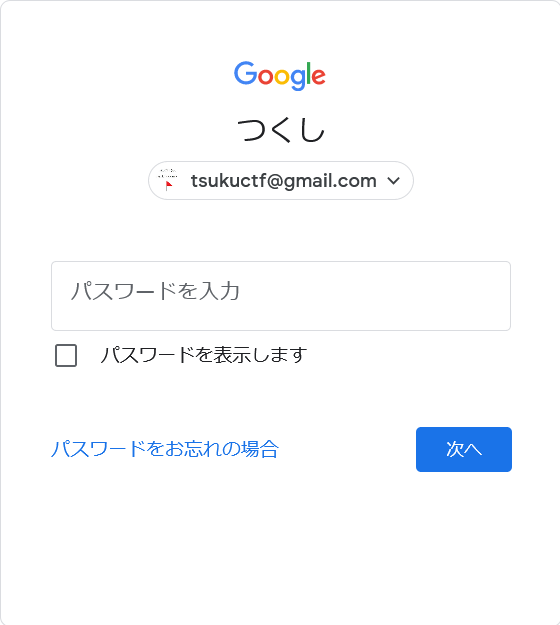
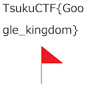

# Tsukushi_no_email1

## 問題文
TsukushiくんはTsukuCTF開催にあたって[自分のメールアドレス](https://tsukuctf.sechack365.com/rules)を使ったようです。彼は顔写真をフラグで隠したと言っています。メールアドレスを頼りにフラグを見つけてください。  

## 難易度
**easy**  

## 作問にあたって
Googleを利用した問題を出したいと思い、作問しました。  
案外自分の知らないところで顔写真などが漏洩しているかもしれません。  
パスワードリセットやログイン途中のページでは一部情報が取得できるサービスが多いためそれを知っていただきたかったです。  
ちなみにメールからアイコンを見ることもできるので、その解法も想定して受け取ったメールにはすべて返信するようにしていました。  

## 解法
リンク先に飛ぶと`tsukuctf@gmail.com`がこのCTFのメールアドレスであることがわかる。  
これを用いてGoogleのログインを途中まで試みると、下のような画面となる。  
  
アイコン部分に何か表示されているのがわかるので、開発者ツールなどで画像を大きめに表示してやる。  
  
flagが書かれていた。  
ちなみに[Tsukushi_no_email2](../tsukushi_no_email2)で利用したGHuntを用いることでも取得できる。  

## TsukuCTF{Google_kingdom}
