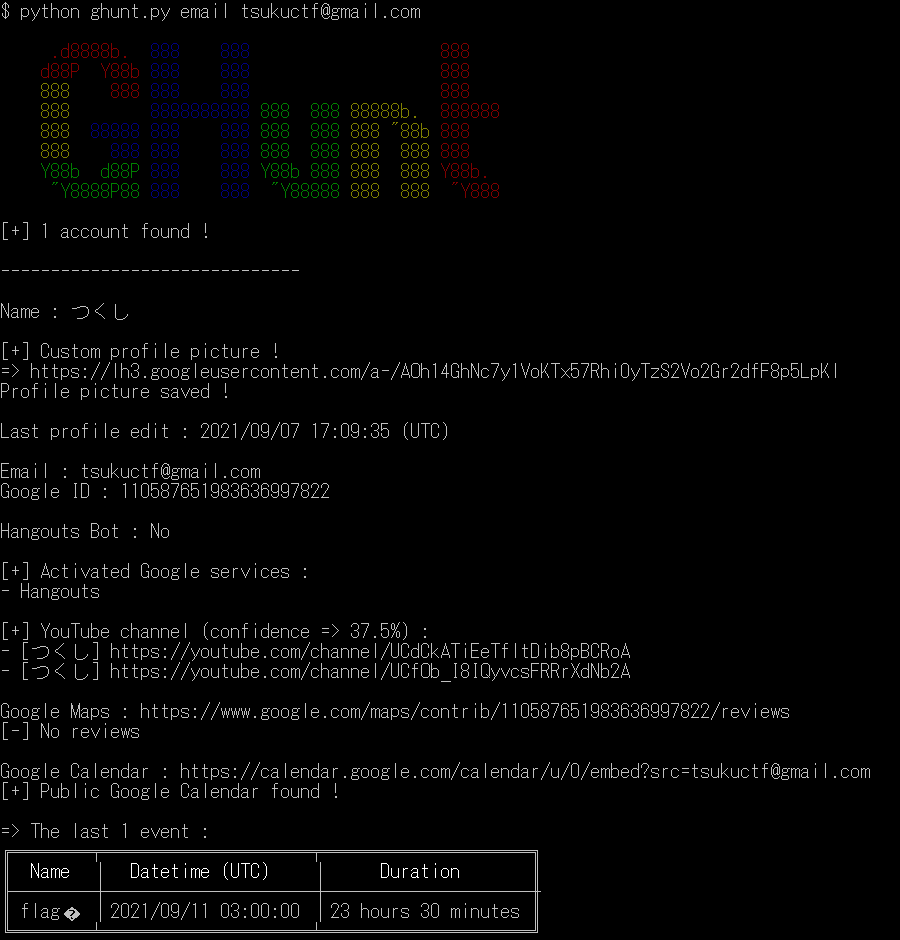
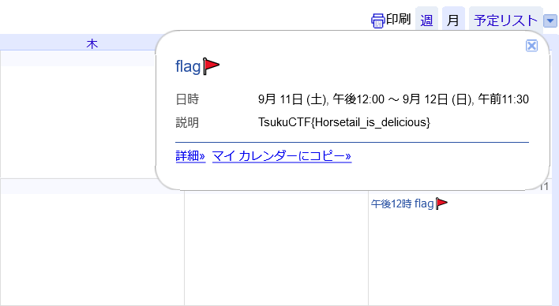

# Tsukushi_no_email2

## 問題文
Tsukushi_no_email1でメールアドレスから様々な情報が得られることがわかりました。Tsukushiくんの今日の予定を調査してください。  

## 難易度
**medium**  

## 作問にあたって
Googleから効率的に情報を収集する方法について知っていただきたかったです。  

## 解法
[Tsukushi_no_email1](../tsukushi_no_email1)から`tsukuctf@gmail.com`がこのCTFのメールアドレスであることがわかる。  
Googleの情報を取得したい場合以下のツールを使用することが多い。  
GHunt  
[https://github.com/mxrch/GHunt](https://github.com/mxrch/GHunt)  
ここにメールアドレスを入れると次のような出力となる。  
  
なにか予定があることがわかる。  
  
カレンダーを出力されたURLから見るとflagが書かれていた。  

## TsukuCTF{Horsetail_is_delicious}
